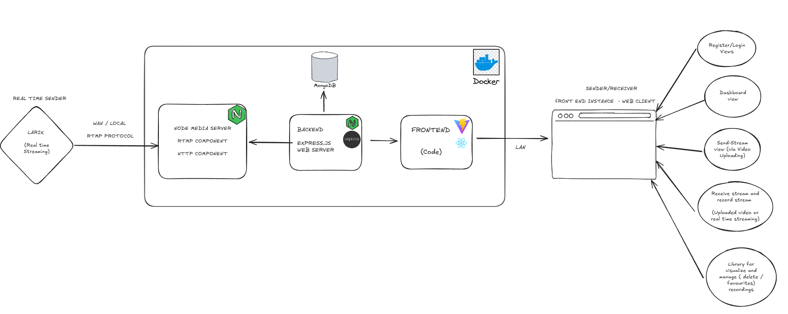

# MultiAdvancedFlow

Full‑stack platform for video upload, live restreaming, playback, and recording built with **React/Vite**, **Node.js/Express**, **Node‑Media‑Server** and **MongoDB**. Out‑of‑the‑box Docker deployment lets you spin up a personal streaming service in seconds.

**Demo**: After running `docker compose up -d`, open [http://localhost](http://localhost) and register a new user.

---

## ✨ Features

| Category        | Highlights |
|-----------------|------------|
| **Live Streaming** | Upload an MP4 and the backend restreams it to viewers via HLS in real time. It is also possible to send streams via external devices. |
| **Recording**   | One‑click start/stop while watching; recordings are stored as MP4 and listed in Library. |
| **Authentication** | JWT‑based login/registration with password hashing (bcrypt). |
| **Favourites**  | Mark recordings with ★ and access them under the Favourites tab. |
| **Low‑latency HLS** | 1‑second segments and playlist size 2. |
| **Dockerised stack** | Frontend, API, Multimedia Server (NMS) and MongoDB ready to ship. |

## 🖧 Architecture




> More technical detail lives in the **Reference Manual**.

---

## 🚀 Quick Start (Docker)

**Prerequisites**: Docker 24+ and Docker Compose v2

```bash
$ git clone https://github.com/DotCSanova/nms_multadvser_epsl.git
$ cd nms_multadvser_epsl/web-server
$ cp .env.example .env   # adjust JWT_SECRET etc.
$ cd ..
$ docker compose up -d --build
```

## 🛠️ Services

- **Frontend**: [http://localhost](http://localhost)
- **API**: [http://localhost:3000](http://localhost:3000)
- **NMS HTTP**: [http://localhost:8000](http://localhost:8000)
- **RTMP ingest**: `rtmp://localhost:1935/live`

---

## 🛠️ Manual Setup (no Docker)

See section 4.2 of the **Reference Manual** for step‑by‑step instructions.

---

## 🛠️ Tech Stack

- **Frontend**: React 18 · Vite 5
- **Backend**: Node.js 20 · Express 4 · Mongoose 8
- **Media Server**: Node‑Media‑Server 2.6 · FFmpeg 6.1
- **Database**: MongoDB 5+

## 📑 API

REST endpoints are located under `web-server/src/api/*` and are fully documented in the [Reference Manual, section 7](docs/reference_manual.md#7-rest-api-reference).

---

## 🤝 Contributing

We welcome contributions of all kinds!  
Please follow these steps:

1. **Fork** the repository and **create a new branch**:

    ```bash
    git checkout -b feat/my-feature
    ```

2. **Lint and test** your changes before committing:

    ```bash
    pnpm lint && pnpm test
    ```

3. **Submit a Pull Request (PR)** against the `main` branch with a clear and concise description of your changes.

4. For **larger changes**, we recommend opening a **draft PR** or starting a **discussion** first.

Thank you for helping make this project better! 🚀

---

## 🙋 Support

- Open an [issue](https://github.com/DotCSanova/nms_multadvser_epsl/issues) if you encounter any problems.
- Alternatively, you can submit a [Pull Request (PR)](https://github.com/DotCSanova/nms_multadvser_epsl/pulls) with improvements or fixes.

We aim to respond as soon as possible!

---

## 📄 License

This project is licensed under the **MIT License**.  
See [LICENSE.md](LICENSE.md) for complete details.
