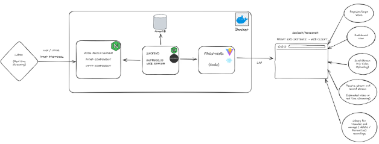
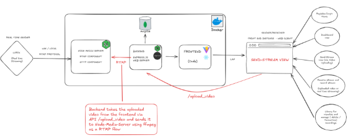
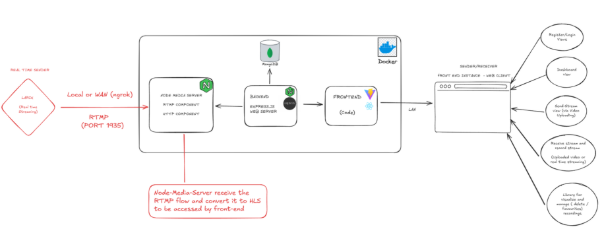

4

## COURSE PRACTICE 2 2025 ADVANCE MULTIMEDIA SERVICES

Reference Manual System for        a Streaming Platform ( MultiAdvancedFlow )

Alberto Lo pez Casanova Manuel A  ngel Vega Go mez

0

|    1 | INTRODUCTION   . ...................................................................................................................... 2                                          |
|------|------------------------------------------------------------------------------------------------------------------------------------------------------------------------------------|
|  2   | SYSTEM REQUIREMENTS   . .......................................................................................................... 2                                               |
|  2.1 | MAIN SOFTWARE CORE VERSIONS ...................................................................................................................................  2                 |
|  3   | ARCHITECTURE   . ....................................................................................................................... 3                                         |
|  3.1 | COMPONENT RESPONSIBILITIES  .......................................................................................................................................  3             |
|  3.2 | UPLOAD-TO-LIVE SEQUENCE  ...........................................................................................................................................  3            |
|  3.3 | UPLOAD LIVE STREAMING SEQUENCE ................................................................................................................................  4                 |
|  4   | INSTALLATION & DEPLOYMENT  .................................................................................................. 4                                                    |
|  4.1 | QUICK START (DOCKER)   ..................................................................................................................................................  4       |
|  4.2 | RUNNING WITHOUT DOCKER ..................................................................................................................................  5                       |
|  4.3 | ENVIRONMENT VARIABLES  ..............................................................................................................................................  5           |
|  5   | TECHNICAL FLOWS  ................................................................................................................... 6                                             |
|  6   | WEB SERVER BACKEND REST API REFERENCE ................................................................................ 8                                                           |
|  6.1 | CONVENTIONS   ................................................................................................................................................................  8  |
|  6.2 | ENDPOINTS .....................................................................................................................................................................  8 |
|  7   | SECURITY ..............................................................................................................................  10                                        |
|  8   | MONITORING AND MAINTENANCE   . ..........................................................................................  10                                                      |
|  9   | TROUBLESHOOTING  ...............................................................................................................  10                                               |
| 10   | GLOSSARY  ............................................................................................................................  11                                         |
| 11   | LICENSE & CONTACT   . ..............................................................................................................  12                                           |

## 1 Introduction

MultiAdvancedFlow is a full-stack  web application  for uploading,  live-restreaming,  viewing, recording  and organising  video.  Built  with React + Vite, Node/Express,  Node-Media-Server (NMS) and MongoDB, it  targets  educational  and leisure  scenarios  where users  need to mix on-demand uploads with low-latency live playback. It also provides the ability to interact  with live and recorded content anytime

## 2 System Requirements

| Layer                         | Minimum                        | Recommended      |
|-------------------------------|--------------------------------|------------------|
| Linux/macOS/Windows 10        | Windows 10                     | Operating System |
| 2 cores, 4 GB RAM             | 4 cores, 8 GB RAM              | CPU              |
| Modern browser, 1280×720      | Chrome / Firefox / Edge latest | Frontend         |
| Node.js ≥ 20.x                | Node.js 20.5.0                 | Backend          |
| MongoDB ≥ 5.0                 | MongoDB 6.0                    | Database         |
| FFmpeg ≥ 6.1                  | Same                           | Media            |
| Docker 24+, docker-compose v2 | -                              | Container        |

## 2.1 MAIN SOFTWARE CORE VERSIONS

| Technology   | Versions used in repo         | Minimum supported   |
|--------------|-------------------------------|---------------------|
| 18.3.1       | 18.x                          | React               |
| 5.4.1        | 5.x                           | Vite                |
| 4.21.2       | 4.18                          | Express             |
| 2.6.1        | 2.6.0                         | Node-media-Server   |
| 8.12.1       | 8.x (Requires  MongoDB ≥ 5.0) | Mongoose            |
| 8.10         | 8.x                           | Video.js (player)   |

## 3 Architecture



## 3.1 COMPONENT RESPONSIBILITIES

The global responsibilities  or functions of each component are:

- · Frontend UI, JWT handling, HLS playback (video.js), recording library management.
- · Backend  Auth (JWT), REST APIs, FFmpeg, save recordings, MongoDB.
- · Node-Media-Server RTMP ingestion, on-the-fly HLS packaging.

## 3.2 UPLOAD-TO-LIVE SEQUENCE

The sending  of  the  streaming  can be  done  by uploading  a  video  from  the  frontend  as  the following diagram shows:



## 3.3 UPLOAD LIVE STREAMING SEQUENCE

It is also possible to send a streaming (real-time  flow) from an external device (e.g Larix Client) to the Node-Media-Server directly via RTMP as the following diagram shows:



## 4 Installation &amp; Deployment

## 4.1 QUICK START (DOCKER)

Prerequisites:  docker &amp; docker-compose v2 installed.

```
$ git clone https://github.com/DotCSanova/nms_multadvser_epsl $ cd nms_multadvser_epsl/web-server $ cp .env.example .env  # edit variables if needed $ cd .. $ docker compose up -d --build
```

Services start  on:

- · Frontend : http://localhost

- · Web-server (Backend APIs) : http://localhost:3000
- · NMS HTTP/HLS : http://localhost:8000
- · NMS RTMP : rtmp://localhost:1935/live

## 4.2 RUNNING WITHOUT DOCKER

- 1. Install Node 20+ and MongoDB.
- 2. npm install inside /frontend , /web-server , /node-media-server .
- 3. Launch in separate terminals:

```
# database mongod --dbpath ./mongodb_data # node media server --node index.js # backend pnpm start # frontend pnpm start
```

Important  Note:

Therefore,  running  it  outside  Docker  may  require  additional modifications particularly  concerning URIs used to connect to different services.

Please  note  that  this  app  is  intended  and  designed  to  run  inside  Docker. to  the  code,

## 4.3 ENVIRONMENT VARIABLES

The  following  table  shows  the  different  environment  variables  used  in  the  app,  some  are included in the '.env' file of the 'web-server' directory and other (majority)  are included in the 'docker-compose' file of the app, which is located in the main/general  directory.

| Variable          | Default                                                                 | Description                                                                       |
|-------------------|-------------------------------------------------------------------------|-----------------------------------------------------------------------------------|
| VITE_BACKEND_ URI | http://localhost:3000                                                   | Injected  in  frontend,  needed  to  send requests  to  the  web- server backend. |
| MONGO_URI         | mongodb://root:multimedia@db:27017/N MS_MULTIMEDIA_DB?authSource=ad min | MongoDB connection.                                                               |
| JWT_SECRET        | change-me                                                               | Token signing key.  Please change for your case.                                  |

| NMS_URI      | http://multimedia_server:8000   | NMS  HTTP  URL  with  respect  the docker container  name  (ID).  It  is  injected  in  the  backend  to  make  requests  to  the  node  media  server.   |
|--------------|---------------------------------|-----------------------------------------------------------------------------------------------------------------------------------------------------------|
| NMS_RTMP_URI | rtmp://multimedia_server:1935   | RTMP  ingest  URL.  It  is  injected  in  the  backend  to  send  RTMP  traffic  to  the  node media server.                                              |

## 5 Technical Flows

The flows below describe  runtime  interactions  among components.  UI navigation details  are intentionally  omitted-see the User Manual for step-by-step screen guidance.

|   # | Flow                          | Entry Point / Protocol   | Backend  Action                           | NMS  Actio n             | Result                                        |
|-----|-------------------------------|--------------------------|-------------------------------------------|--------------------------|-----------------------------------------------|
|   1 | User  Registra tion           | POST /api/auth/register  | hash  (bcrypt)  → store in  MongoDB       | -                        | 201 Created                                   |
|   2 | Login  & JWT  issuance        | POST /api/auth/login     | Verify  credentials  → sign  JWT  (HS256) | -                        | 200+ token                                    |
|   3 | Upload  video->  Live  Stream | POST /api/upload_video   |                                           | Packa ge  HLS  segme nts | Clients pull  /live/<stream_name>/in dex.m3u8 |

|     | Visualiza tion              |                                             |                                                       |    |                                              |
|-----|-----------------------------|---------------------------------------------|-------------------------------------------------------|----|----------------------------------------------|
| 4   | Enumer ate  Active  Streams | GET  /api/streams/active_stre ams           | Proxy &  format  GET  /api/str eams (NMS)             | -  | JSON list of Streams  URLs available in  NMS |
| 5   | Start  Recordi ng           | POST /api/record/start- recording           | FFmpeg  pulls  RTMP  (NMS)→s ave MP4,  index  MongoDB | -  | recordingId  returned                        |
| 6   | Stop  Recordi ng            | POST /api/record/stop- recording            | Stop  FFmpeg,  persist  duration                      | -  | 200 OK                                       |
| 7   | Fetch  Recordi ngs          | GET  /api/record/recordings                 | Query  MongoDB                                        | -  | Array of recordings                          |
| 8   | Delete  Recordi ng          | DELETE  /api/record/recordings/: id         | Remove  MP4 +  DB doc                                 | -  | 200 OK                                       |
| 9   | Toggle  Favourit e          | PATCH  /api/record/recordings/: id/favorite | Update  favourite  flag                               | -  | 200 OK                                       |
| 1 0 | Playbac k  Recordi ng       | GET  /api/record/recordings/: id/stream     | Stream  MP4 w/  Accept- Ranges                        | -  | Progressive playback                         |

## 6 WEB SERVER BACKEND REST API REFERENCE

## 6.1 CONVENTIONS

- · Auth - send Authorization:  Bearer &lt;JWT&gt; header.
- · All bodies are application/json  unless file upload.

## 6.2 ENDPOINTS

## POST /api/auth/register

```
curl -X POST http://localhost:3000/api/auth/register \ -H "Content-Type: application/json" \ -d '{"username":"alice","password":"Passw0rd!"}'
```

## Success 201

```
{ "message": "User created" }
```

```
Errors 400 Validation , 409 Conflict , 500 Server .
```

## POST /api/auth/login

```
curl -X POST http://localhost:3000/api/auth/login \ -H "Content-Type: application/json" \ -d '{"username":"alice","password":"Passw0rd!"}'
```

## Success 200

```
{ "token": "<jwt>", "expiresIn": 3600 }
```

```
Errors 401 Invalid credentials, 500. GET /api/streams/active_streams
```

```
curl -H "Authorization: Bearer $JWT" \ http://localhost:3000/api/streams/active_streams
```

## Success 200

```
[{ "streamId":"alice","url":"http://localhost:8000/live/alice/index.m3u8" }]
```

## POST /api/upload\_video

```
curl -X POST http://localhost:3000/api/upload_video \ -H "Authorization: Bearer $JWT" \ -F file=@video.mp4
```

## Success 200

```
{ "message":"Upload correctly" }
```

```
Errors 500 Upload failed .
```

## POST /api/record/start-recording

```
curl -X POST http://localhost:3000/api/record/start-recording \ -H "Authorization: Bearer $JWT" \ -H "Content-Type: application/json" \ -d '{"streamId":"alice"}'
```

## Success 200

```
{ "message":"Recording started" }
```

Errors 400 Parameters left, 404 User not found, 500 Upload failed .

## POST /api/record/stop-recording

(similar  body).

Returns

```
{ "message":"Recording stopped" }.
```

Errors 500 Server .

## GET /api/record/recordings

```
curl -H "Authorization: Bearer $JWT" \ http://localhost:3000/api/record/recordings
```

Success 200 - Array of recording metadata.

## DELETE /api/record/recordings/:id

```
curl -X DELETE -H "Authorization: Bearer $JWT" \
```

```
http://localhost:3000/api/record/recordings/6632...
```

## PATCH /api/record/recordings/:id/favorite

curl -X PATCH -H "Authorization: Bearer $JWT" \

- -H "Content-Type: application/json" \
- -d '{"favorite":true}' \

http://localhost:3000/api/record/recordings/6632/favorite

## GET /api/record/recordings/:id/stream

Returns MP4 with Accept-Ranges for seeking.

## 7 Security

- · Authentication - stateless JWT (HS256). Default expiry 1 h.
- · Token rotation - client should refresh shortly before expiry.
- · Authorization - middleware validates user tokens.
- · CORS - frontend origin whitelisted via env CORS\_ORIGIN .
- · Secrets - store in .env , never commit.

## 8 Monitoring and maintenance

| Aspect                                  | Tool/Command        | Purpose     |
|-----------------------------------------|---------------------|-------------|
| Docker logs nms_multimedia_server       | NMS status &        | Logs        |
| docker stats                            | CPU/RAM/Net  usage  | Metrics     |
| curl  http://localhost:8000/api/streams | Active NMS  streams | Stream list |

## 9 Troubleshooting

| Error Message            | Likely Cause       | Fix                      |
|--------------------------|--------------------|--------------------------|
| Invalid or expired token | JWT expired        | Login again              |
| Recording not found      | Wrong ID / deleted | Verify ID, check MongoDB |

| Error fetching streams   | NMS down                  | docker  compose  restart  multimedia_server   |
|--------------------------|---------------------------|-----------------------------------------------|
| Recording file not found | Disk clean-up removed MP4 | Restore from backup                           |

## 10 Glossary

| Term                    | Meaning / Use in This Project                                                                                |
|-------------------------|--------------------------------------------------------------------------------------------------------------|
| AAC                     | Advanced Audio Coding, audio  codec used  in HLS segments.                                                   |
| bcrypt                  | Password-hashing  algorithm  used  when  creating  accounts.                                                 |
| CORS preflight          | Browser  OPTIONS  request  that  checks  cross-origin  permissions  before  the  actual  call.               |
| CRUD                    | Create,  Read,  Update,  Delete  -  core  operations exposed by the REST API.                                |
| Docker & Docker Compose | Container  runtime  and  orchestration  tool  used for one-command deployment.                               |
| FFmpeg                  | Command-line  tool  that encodes  uploads to  RTMP and records HLS back to MP4.                              |
| FFprobe                 | Companion  CLI  from  FFmpeg  suite  for  probing/diagnosing  media streams.                                 |
| Fluent-ffmpeg           | Node.js wrapper around FFmpeg used by the  backend for recording.                                            |
| GOP                     | Group  Of  Pictures;  complete  frame  cycle  transmitted  by  RTMP and re-packaged  into  HLS.              |
| H.264                   | Video codec used inside MP4/HLS segments  for maximum browser compatibility.                                 |
| HLS                     | HTTP  Live  Streaming,  adaptive  protocol  used by browsers to fetch  .m3u8  playlists  and  .ts  segments. |

| JWT                     | JSON  Web  Token  that  carries  the  user  identity;  signed with HS256 in this app.         |
|-------------------------|-----------------------------------------------------------------------------------------------|
| LL-HLS                  | Low-Latency  HLS;  achieved  here  with  1-second segments and playlist  size 2.              |
| Mongoose                | ODM  library  that  maps  MongoDB  collections  to JavaScript models.                         |
| MSE                     | Media  Source  Extensions,  browser  API  leveraged  by  video.js  to  append  HLS  segments. |
| MP4                     | Container  format  used  for  archived  recordings on disk.                                   |
| NMS (Node-Media-Server) | Node.js streaming  server that ingests  RTMP  and produces HLS.                               |
| Playlist  (.m3u8)       | Index file  listing  the order  of HLS segments  for a given stream.                          |
| React                   | Front-end  JavaScript  library  powering  the  SPA.                                           |
| REST                    | Representational  State  Transfer  -  style  followed by all HTTP APIs.                       |
| RTMP                    | Real-Time  Messaging  Protocol  used  by the  backend to push live video into NMS.            |
| Segment (.ts)           | 1-second  video  chunk  referenced  from  the  HLS playlist.                                  |
| Vite                    | Front-end  build  tool  providing  hot  module  reload.                                       |
| video.js                | HTML5 player library used to render HLS in  the browser.                                      |

## 11 License &amp; Contact

- · Code released under MIT License .
- · Report issues or submit PRs at https://github.com/DotCSanova/nms\_multadvser\_epsl.