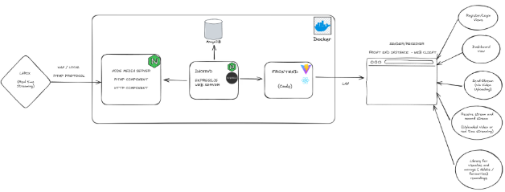
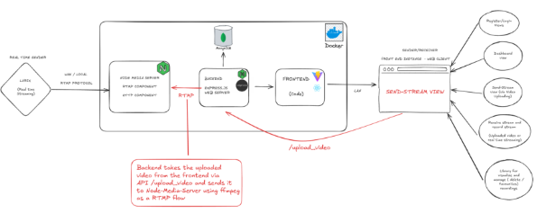
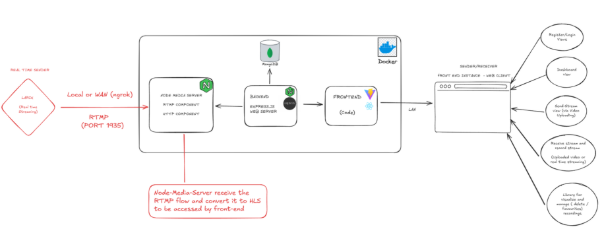



Página 12** de 13**

[**1**	**INTRODUCTION	2****](#_toc196656736)**

[**2**	**SYSTEM REQUIREMENTS	2****](#_toc196656737)

[2.1	Main Software Core Versions	2](#_toc196656738)

[**3**	**ARCHITECTURE	3****](#_toc196656739)

[3.1	Component Responsibilities	3](#_toc196656740)

[3.2	Upload-to-Live Sequence	3](#_toc196656741)

[3.3	Upload live streaming sequence	4](#_toc196656742)

[**4**	**INSTALLATION & DEPLOYMENT	4****](#_toc196656743)

[4.1	Quick Start (Docker)	4](#_toc196656744)

[4.2	RUNNING WITHOUT DOCKER	5](#_toc196656745)

[4.3	Environment Variables	5](#_toc196656746)

[**5**	**TECHNICAL FLOWS	6****](#_toc196656747)

[**6**	**WEB SERVER BACKEND REST API REFERENCE	8****](#_toc196656748)

[6.1	Conventions	8](#_toc196656749)

[6.2	Endpoints	8](#_toc196656750)

[**7**	**SECURITY	10****](#_toc196656751)

[**8**	**MONITORING AND MAINTENANCE	10****](#_toc196656752)

[**9**	**TROUBLESHOOTING	10****](#_toc196656753)

[**10**	**GLOSSARY	11****](#_toc196656754)

[**11**	**LICENSE & CONTACT	12****](#_toc196656755)

1. # **Introduction**
***MultiAdvancedFlow*** is a full‑stack web application for uploading, live‑restreaming, viewing, recording and organising video. Built with React + Vite, Node/Express, Node‑Media‑Server (NMS) and MongoDB, it targets educational and leisure scenarios where users need to mix on‑demand uploads with low‑latency live playback. It also provides the ability to interact with live and recorded content anytime
1. # **System Requirements**

|**Layer**|**Minimum**|**Recommended**|
| :-: | :-: | :-: |
|**Operating System**|Linux/macOS/Windows 10|Windows 10|
|**CPU**|2 cores, 4 GB RAM|4 cores, 8 GB RAM|
|**Frontend**|Modern browser, 1280×720|Chrome / Firefox / Edge latest|
|**Backend**|Node.js ≥ 20.x|Node.js 20.5.0|
|**Database**|MongoDB ≥ 5.0|MongoDB 6.0|
|**Media**|FFmpeg ≥ 6.1|Same|
|**Container**|Docker 24+, dockercompose v2|—|

1. ## **MAIN SOFTWARE CORE VERSIONS**

|**Technology**|**Versions used in repo**|**Minimum supported**|
| :-: | :-: | :-: |
|**React**|18\.3.1|18\.x|
|**Vite**|5\.4.1|5\.x|
|**Express**|4\.21.2|4\.18|
|**Node-media-Server**|2\.6.1|2\.6.0|
|**Mongoose**|8\.12.1|8\.x (Requires MongoDB ≥ 5.0)|
|**Video.js (player)**|8\.10|8\.x|

1. # **Architecture**

1. ## **COMPONENT RESPONSIBILITIES**
The global responsibilities or functions of each component are:

- **Frontend –** UI, JWT handling, HLS playback (video.js), recording library management.
- **Backend  –** Auth (JWT), REST APIs, FFmpeg, save recordings, MongoDB.
- **Node‑Media‑Server –** RTMP ingestion, on‑the‑fly HLS packaging.
  1. ## **UPLOAD-TO-LIVE SEQUENCE**
The sending of the streaming can be done by uploading a video from the frontend as the following diagram shows:

1. ## **UPLOAD LIVE STREAMING SEQUENCE**
It is also possible to send a streaming (real-time flow) from an external device (e.g Larix Client) to the Node-Media-Server directly via RTMP as the following diagram shows:

` `
1. # **Installation & Deployment**
   1. ## **QUICK START (DOCKER)**
Prerequisites: docker & docker-compose v2 installed.

$ git clone https://github.com/DotCSanova/nms\_multadvser\_epsl

$ cd nms\_multadvser\_epsl/web-server

$ cp .env.example .env  # edit variables if needed

$ cd ..

$ docker compose up -d --build

Services start on:

- **Frontend :** http://localhost
- **Web-server (Backend APIs) :** http://localhost:3000
- **NMS HTTP/HLS :** http://localhost:8000
- **NMS RTMP :** rtmp://localhost:1935/live
  1. ## **RUNNING WITHOUT DOCKER**
1. Install Node 20+ and MongoDB.
1. npm install inside /frontend, /web-server, /node-media-server.
1. Launch in separate terminals:

\# database

mongod --dbpath ./mongodb\_data

\# node‑media‑server

node index.js

\# backend

pnpm start

\# frontend

pnpm start

**Important Note:** Please note that this app is intended and designed to run inside Docker. Therefore, running it outside Docker may require additional modifications to the code, particularly concerning URIs used to connect to different services.
1. ## **ENVIRONMENT VARIABLES**
The following table shows the different environment variables used in the app, some are included in the ‘.env’ file of the ‘web-server’ directory and other (majority) are included in the ‘docker-compose’ file of the app, which is located in the main/general directory.

|**Variable**|**Default**|**Description**|
| :-: | :-: | :-: |
|

VITE\_BACKEND\_URI

|

http://localhost:3000
|
Injected in frontend, needed to send requests to the web-server backend.

|
|

MONGO\_URI

|

mongodb://root:multimedia@db:27017/NMS\_MULTIMEDIA\_DB?authSource=admin

|
MongoDB connection.

|
|

JWT\_SECRET

|

**changeme**

|
Token signing key.

Please change for your case.
|
|

NMS\_URI

|

http://multimedia\_server:8000

|
NMS HTTP URL with respect the docker container name (ID). It is injected in the backend to make requests to the node media server.

|
|

NMS\_RTMP\_URI

|

rtmp://multimedia\_server:1935

|
RTMP ingest URL. It is injected in the backend to send RTMP traffic to the node media server.

|

1. # **Technical Flows**
The flows below describe runtime interactions among components. UI navigation details are intentionally omitted—see the User Manual for step‑by‑step screen guidance.

|**#**|**Flow**|**Entry Point / Protocol**|**Backend Action**|**NMS Action**|**Result**|
| :-: | :-: | :-: | :-: | :-: | :-: |
|1|**User Registration**|POST /api/auth/register|Validate→hash (bcrypt) → store in MongoDB|—|201 Created|
|2|
**Login**

**& JWT issuance**
|
POST

/api/auth/login
|Verify credentials → sign JWT (HS256)|—|200+ token|
|3|Upload video-> Live Stream Visualization|
POST /api/upload\_video

||
Package

HLS segments
|Clients pull /live/<stream\_name>/index.m3u8|
|4|**Enumerate Active Streams**|GET /api/streams/active\_streams|Proxy & format GET /api/streams (NMS)|—|JSON list of Streams URLs available in NMS|
|5|**Start Recording**|POST /api/record/start-recording|FFmpeg pulls RTMP (NMS)→save MP4, index MongoDB|—|recordingId returned|
|6|**Stop Recording**|POST /api/record/stop-recording|Stop FFmpeg, persist duration|—|200 OK|
|7|**Fetch Recordings**|GET /api/record/recordings|Query MongoDB|—|Array of recordings|
|8|**Delete Recording**|DELETE /api/record/recordings/:id|Remove MP4 + DB doc|—|200 OK|
|9|**Toggle Favourite**|PATCH /api/record/recordings/:id/favorite|Update favourite flag|—|200 OK|
|10|**Playback Recording**|GET /api/record/recordings/:id/stream|Stream MP4 w/ Accept-Ranges|—|Progressive playback|

1. # **WEB SERVER BACKEND REST API REFERENCE**
   1. ## **CONVENTIONS** 
- Auth – send Authorization: Bearer <JWT> header.
- All bodies are application/json unless file upload.
  1. ## **ENDPOINTS** 
**POST /api/auth/register**

curl -X POST http://localhost:3000/api/auth/register \

`  `-H "Content-Type: application/json" \

`  `-d '{"username":"alice","password":"Passw0rd!"}'

**Success 201**

{ "message": "User created" }

**Errors** 400 Validation, 409 Conflict, 500 Server.

**POST /api/auth/login**

curl -X POST http://localhost:3000/api/auth/login \

`  `-H "Content-Type: application/json" \

`  `-d '{"username":"alice","password":"Passw0rd!"}'

**Success 200**

{ "token": "<jwt>", "expiresIn": 3600 }

**Errors** 401 Invalid credentials, 500.

**GET /api/streams/active\_streams**

curl -H "Authorization: Bearer $JWT" \

`  `http://localhost:3000/api/streams/active\_streams

**Success 200**

[{ "streamId":"alice","url":"http://localhost:8000/live/alice/index.m3u8" }]

**POST /api/upload\_video**

curl -X POST http://localhost:3000/api/upload\_video \

`  `-H "Authorization: Bearer $JWT" \

`  `-F file=@video.mp4

**Success 200** 

{ "message":"Upload correctly" }

**Errors** 500 Upload failed.

**POST /api/record/start-recording**

curl -X POST http://localhost:3000/api/record/start-recording \

`  `-H "Authorization: Bearer $JWT" \

`  `-H "Content-Type: application/json" \

`  `-d '{"streamId":"alice"}'

**Success 200** 

{ "message":"Recording started" }

**Errors** 400 Parameters left, 404 User not found, 500 Upload failed.

**POST /api/record/stop-recording**

(similar body). 

Returns 

{ "message":"Recording stopped" }.

**Errors** 500 Server.

**GET /api/record/recordings**

curl -H "Authorization: Bearer $JWT" \

`  `http://localhost:3000/api/record/recordings

**Success 200** – Array of recording metadata.

**DELETE /api/record/recordings/:id**

curl -X DELETE -H "Authorization: Bearer $JWT" \

`  `http://localhost:3000/api/record/recordings/6632...

**PATCH /api/record/recordings/:id/favorite**

curl -X PATCH -H "Authorization: Bearer $JWT" \

`  `-H "Content-Type: application/json" \

`  `-d '{"favorite":true}' \

`  `http://localhost:3000/api/record/recordings/6632/favorite

**GET /api/record/recordings/:id/stream**

Returns MP4 with Accept-Ranges for seeking.

1. # **Security**
- **Authentication** – stateless JWT (HS256). Default expiry 1 h.
- **Token rotation** – client should refresh shortly before expiry.
- **Authorization** – middleware validates user tokens.
- **CORS** – frontend origin whitelisted via env CORS\_ORIGIN.
- **Secrets** – store in .env, never commit.
1. # **Monitoring and maintenance**

|**Aspect**|**Tool/Command**|**Purpose**|
| :-: | :-: | :-: |
|**Logs**|Docker logs nms\_multimedia\_server|API Requests, NMS status & FFmpeg events|
|**Metrics**|docker stats|CPU/RAM/Net usage|
|**Stream list**|curl http://localhost:8000/api/streams|Active NMS streams|

1. # **Troubleshooting**

|**Error Message**|**Likely Cause**|**Fix**|
| :-: | :-: | :-: |
|Invalid or expired token|JWT expired|Login again|
|Recording not found|Wrong ID / deleted|Verify ID, check MongoDB|
|Error fetching streams|NMS down|docker compose restart multimedia\_server|
|Recording file not found|Disk cleanup removed MP4|Restore from backup|

1. # **Glossary**

|**Term**|**Meaning / Use in This Project**|
| :-: | :-: |
|**AAC**|Advanced Audio Coding, audio codec used in HLS segments.|
|**bcrypt**|Passwordhashing algorithm used when creating accounts.|
|**CORS preflight**|Browser OPTIONS request that checks crossorigin permissions before the actual call.|
|**CRUD**|Create, Read, Update, Delete – core operations exposed by the REST API.|
|**Docker & Docker Compose**|Container runtime and orchestration tool used for onecommand deployment.|
|**FFmpeg**|Commandline tool that encodes uploads to RTMP and records HLS back to MP4.|
|**FFprobe**|Companion CLI from FFmpeg suite for probing/diagnosing media streams.|
|**Fluentffmpeg**|Node.js wrapper around FFmpeg used by the backend for recording.|
|**GOP**|Group Of Pictures; complete frame cycle transmitted by RTMP and repackaged into HLS.|
|**H.264**|Video codec used inside MP4/HLS segments for maximum browser compatibility.|
|**HLS**|HTTP Live Streaming, adaptive protocol used by browsers to fetch .m3u8 playlists and .ts segments.|
|**JWT**|JSON Web Token that carries the user identity; signed with HS256 in this app.|
|**LLHLS**|LowLatency HLS; achieved here with 1second segments and playlist size 2.|
|**Mongoose**|ODM library that maps MongoDB collections to JavaScript models.|
|**MSE**|Media Source Extensions, browser API leveraged by video.js to append HLS segments.|
|**MP4**|Container format used for archived recordings on disk.|
|**NMS (NodeMediaServer)**|Node.js streaming server that ingests RTMP and produces HLS.|
|**Playlist (.m3u8)**|Index file listing the order of HLS segments for a given stream.|
|**React**|Frontend JavaScript library powering the SPA.|
|**REST**|Representational State Transfer – style followed by all HTTP APIs.|
|**RTMP**|RealTime Messaging Protocol used by the backend to push live video into NMS.|
|**Segment (.ts)**|1second video chunk referenced from the HLS playlist.|
|**Vite**|Frontend build tool providing hot module reload.|
|**video.js**|HTML5 player library used to render HLS in the browser.|

1. # **License & Contact**
- Code released under **MIT License**.
- Report issues or submit PRs at <https://github.com/DotCSanova/nms_multadvser_epsl>.

